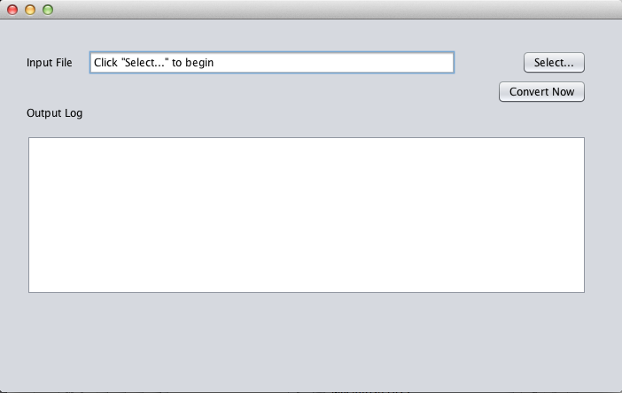
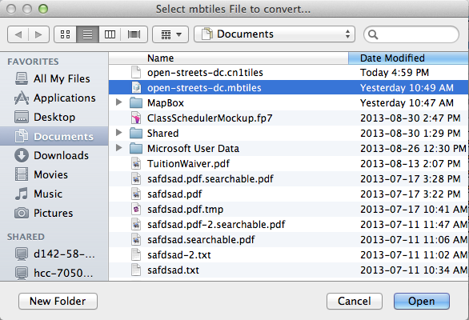
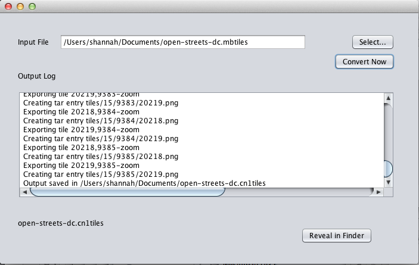

#CN1TileConverter
A tool to convert [MBTiles](https://www.mapbox.com/developers/mbtiles/) Map Files to CN1Tiles format.

##Synopsis
This is a simple desktop tool to convert mbtiles offline map files to cn1tiles format so that it can be used inside [Codename One](http://www.codenameone.com) applications via the [CN1OfflineMaps library](https://github.com/shannah/CN1OfflineMaps).

##License

 LGPL

##Installation

1. Clone this repository

`git clone https://github.com/shannah/CN1TileConverter.git`

2. Inside the `CN1TileConverter/dist` directory, you'll find a file named `CN1TileConverter.jar`.   This is a double-clickable jar file that will open the application.

##Usage
**Step 0:** Design your offline map using [TileMill](https://www.mapbox.com/tilemill/) and export it as an [MBTiles](https://www.mapbox.com/developers/mbtiles/) file.

**Step 1:**  Open the CN1TileConverter application by double clicking the `CN1TileConverter.jar` file (inside the dist directory).

This will open up a window as shown below:

**Step 2:**  Click the "Select…" button and navigate to the `.mbtiles` file you wish to convert.

**Step 3:** Watch the output log as it carries out the conversion.  When it is done, you can click the "Reveal" button to open the folder that contains the output file.

*The output file is saved to the same location as the input file, but with the extension `.cn1tiles` instead of `.mbtiles`.*

**Step 4:** Load your newly created `cn1tiles` file in your Codename One application to include offline maps in your application.

This step requires the CN1OfflineMaps library.

##What is the `cn1tiles` format?

The `.mbtiles` format was designed to allow you to store offline maps in a consistent format.  It consists of an SQLite database with all of the tiles stored inside the database.   Unfortunately many mobile platforms don't support blob columns in SQLite databases so the format is not ideal for use in Codename One applications.  Some advanced target platforms may support it, but others will have problems.  

The `cn1tiles` format stores the same information as an `.mbtiles` database, except that it stores all of the map metadata and tiles as a tar.gz archive.  (If you want to see what is inside a `.cn1tiles` file you can just change the extension to `.tar.gz1` and extract it).  The archive  structure is as follows:

~~~
mymap.cn1tiles/
    +--- metadata.json
    +--- tiles/ (directory will all of the tiles)
~~~

The metadata.json contains all the same information as the `mbtiles` metadata table, except it is stored as a JSON object.

This format can be imported into a Codename One application via the MBTilesProvider class.

## References
            
1. [MBTiles specification](https://www.mapbox.com/developers/mbtiles/)
2. [TileMill by Mapbox](https://www.mapbox.com/tilemill/) - An application that allows you to build your own maps and export them to MBTiles format.
3. [CN1OfflineMaps](https://github.com/shannah/CN1OfflineMaps) The Codename One offline Maps project
4. [Codename One](http://www.codenameone.com)

